<h1 align="center">Hi, I'm Adam Shigley 👋</h1>
 
<h3 align="center">I'm a computer science student at Weber State University! Please check out some of my projects below.</h3>

 
<h3 align="center">Check out the full repo: <a href="https://github.com/ashiggles/CS_Portfolio" target="_blank" rel="noreferrer">CS_Portfolio</a></h3>
 

<h4>📄 <a href="https://github.com/ashiggles/CS_Portfolio/tree/master/Projects/Node_Express_File_Storage" target="_blank" rel="noreferrer">Node And Express File Storage</a></h4>

 - This project included setting up Node with Express as well as demonstrating file storage. This project used a web form that allowed user input. I had to create a web form on one page, another page that displayed all text from the form submission, and another page that asks for a food item then matching results would display. The challenging part of this project was setting up and learning backend routing.

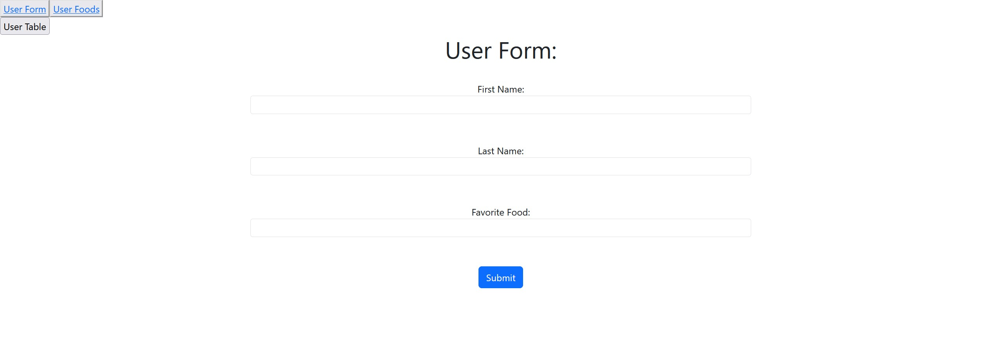
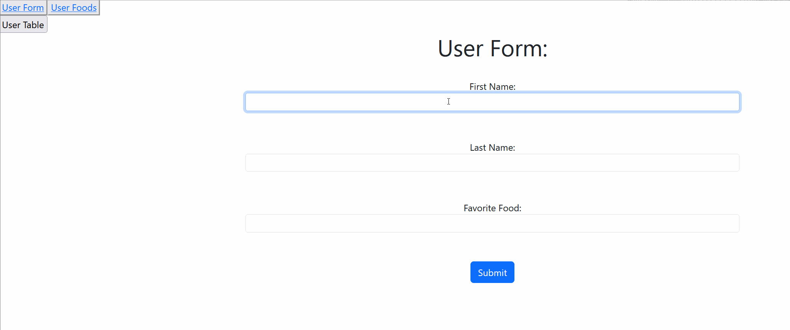

<h4>🌱 <a href="https://github.com/ashiggles/CS_Portfolio/tree/master/Projects/React_Connect_Four" target="_blank" rel="noreferrer">React Connect Four Game</a></h4>

 - Let's play Connect Four! This project consisted of creating a Connect Four game with React. This project was fun and fun to play after it was created. The most challenging part of this project was figuring out a way to drop tiles to the bottom of the grid. This is also the first project we learned React.

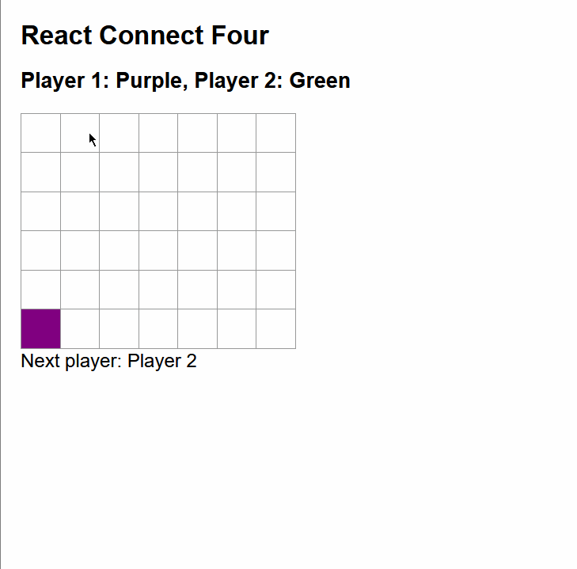

<h4>📝 <a href="https://github.com/ashiggles/CS_Portfolio/tree/master/Projects/RESTful_API_Bank_Account" target="_blank" rel="noreferrer">RESTful API Bank Account</a></h4>

 - This project utilizes RESTful API and creates a backend for registering and accepting new bank account information. In this project we used Node, Express, and Mongo DB. The most interesting, but also the most challenging, part was learning RESTful API and getting experience using GET and POST. We had to create a full account registration, login, and user account list.

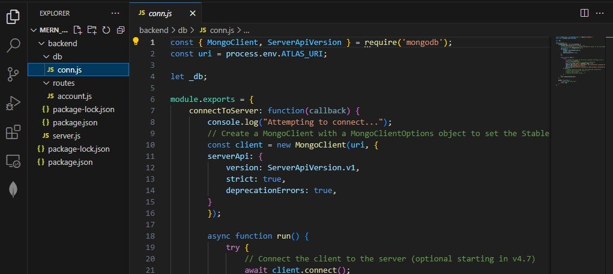
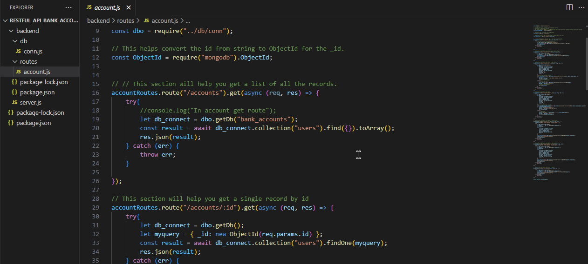

<h4>⚡ <a href="https://github.com/ashiggles/CS_Portfolio/tree/master/Projects/MERN_And_Sessions" target="_blank" rel="noreferrer">MERN And Sessions</a></h4>

 - This project used the MERN stack and session data to create a functioning bank account application. This project was an extension to the previous project. In this project we added a React frontend for users.

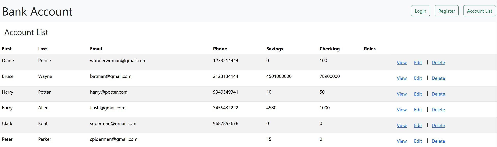
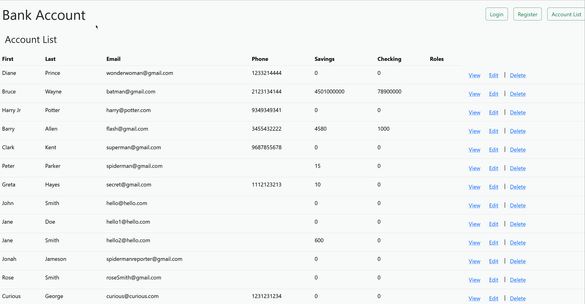

<h4>🌱 <a href="https://github.com/ashiggles/CS_Portfolio/tree/master/Projects/MERN_Hangman_Game" target="_blank" rel="noreferrer">MERN Hangman Game</a></h4>

 - Anyone for a game of Hangman? This was a group project with <a href="https://github.com/KristaSmith1" target="_blank" rel="noreferrer">KristaSmith1</a>. We developed a functioning Hangman Game using the MERN stack. This was the first project where we utilized the full MERN stack. This project was also fun and fun to play after it was developed. The most challenging part was figuring out a way to add 1000+ words to our Mongo database. I found a way to generate randomly selected words and POST them to our database.

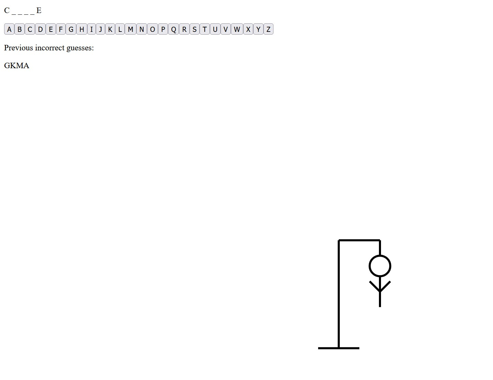
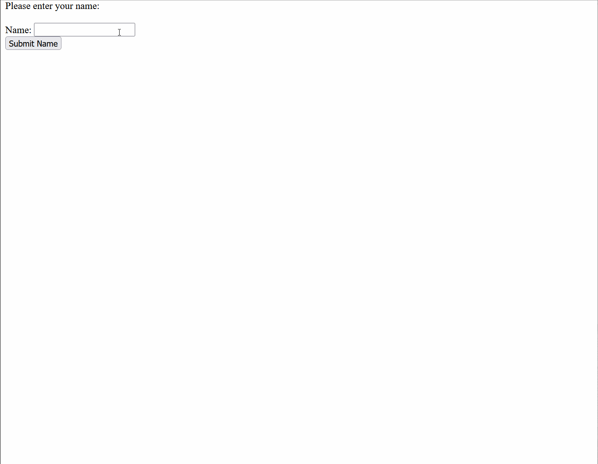

<h4>📝 <a href="https://github.com/ashiggles/CS_Portfolio/tree/master/Projects/MERN_Banking_Website" target="_blank" rel="noreferrer">MERN Banking Website</a></h4>

 - This was a group project with <a href="https://github.com/KristaSmith1" target="_blank" rel="noreferrer">KristaSmith1</a> and <a href="https://github.com/Acroft96" target="_blank" rel="noreferrer">Acroft96</a>. We developed a functioning Banking website using the MERN stack. This project was a two part project where the first part was developing the frontend. We broke up the project in three ways and worked on our individual parts, this seemed to work the best. The second part was developing the backend and routing for all our banking data. We also broke this part up in three ways. The most challenging part was setting up the backend routing for all the user information we were displaying and editing. Overall I think this project went really well and turned out well.

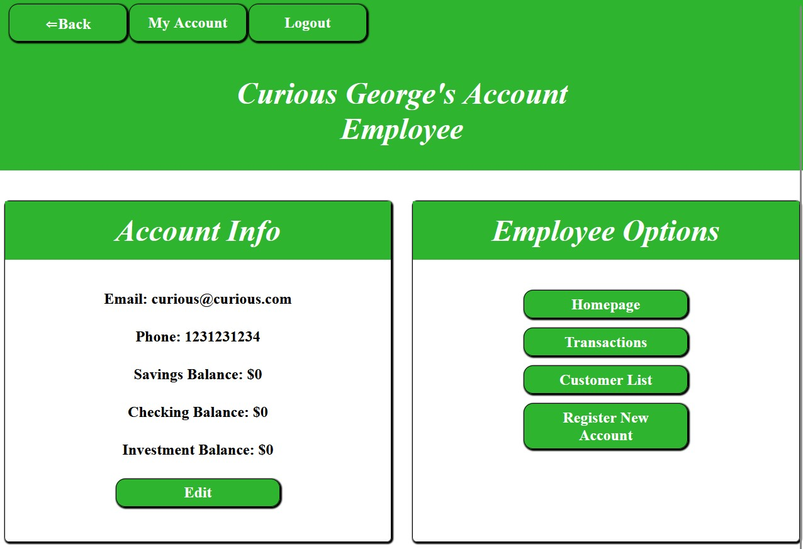
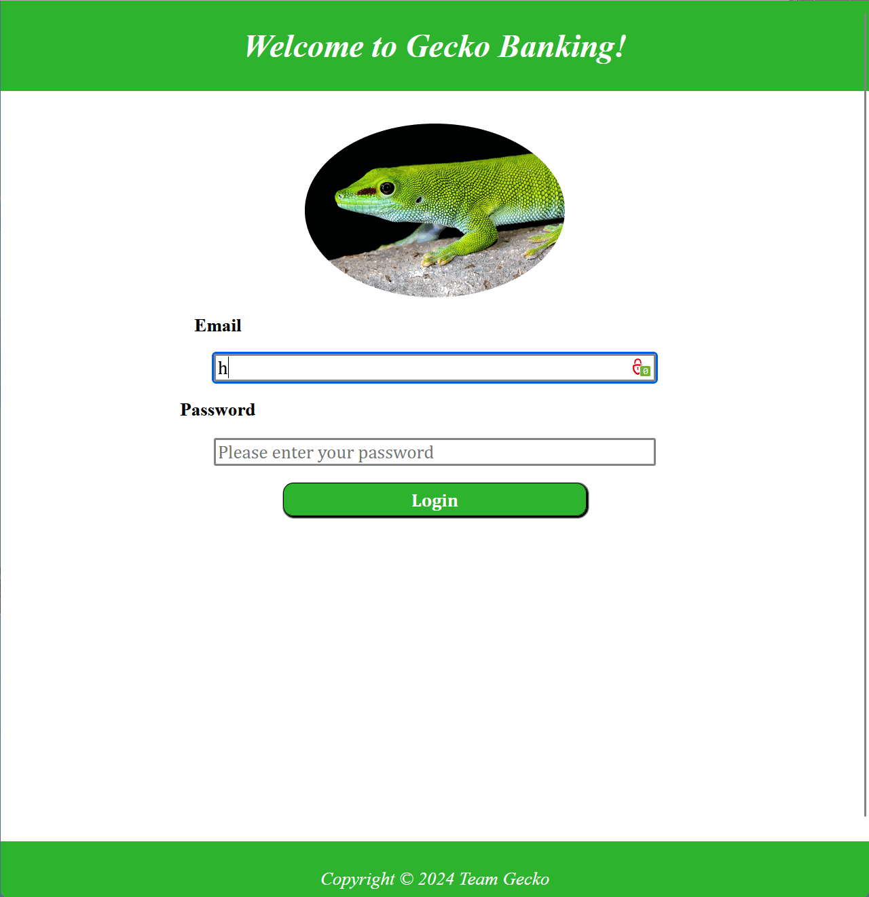

<h4>🖥️ <a href="https://github.com/ashiggles/CS_Portfolio/tree/master/Projects/CSharp_Simple_Store_System" target="_blank" rel="noreferrer">C# Simple Store System</a></h4>

 - This project consisted of creating a Simple Store System that has inventory tracking, company tracking, and a search functionality. This project utilized the C# programming language. It comprises of three different forms that are accessed from one window. This was a CRUD heavy project such that every form has the ability to create, read, update, and delete items from the system.

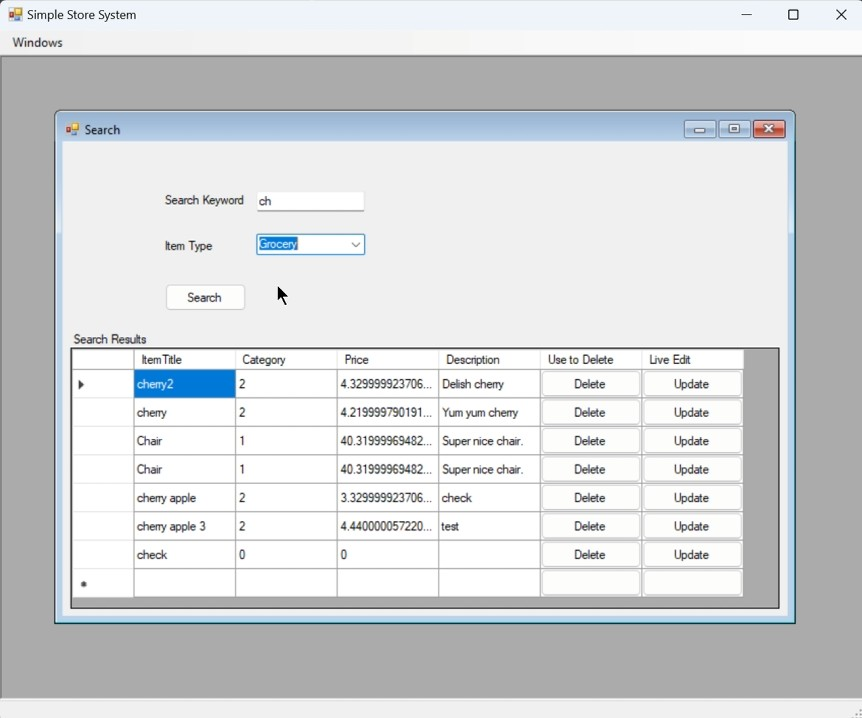

 

<h3 align="left">Connect with me:</h3>
<h4>🔭 <a href="https://github.com/ashiggles" target="_blank" rel="noreferrer">GitHub Profile</a></h4>
<h4>🔭 <a href="https://www.linkedin.com/in/adam-shigley-b84b9a94/" target="_blank" rel="noreferrer">LinkedIn Profile</a></h4>

 

<h3 align="left">Experience with Languages and Tools:</h3>

 
    
    
    
    
    
    
    
    
    
     
    
    
    
     

