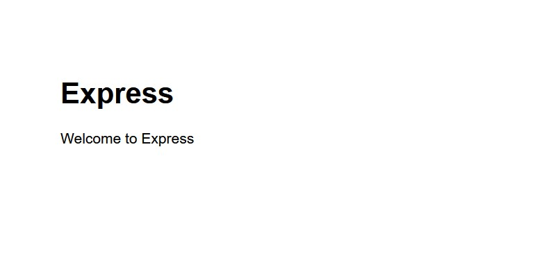
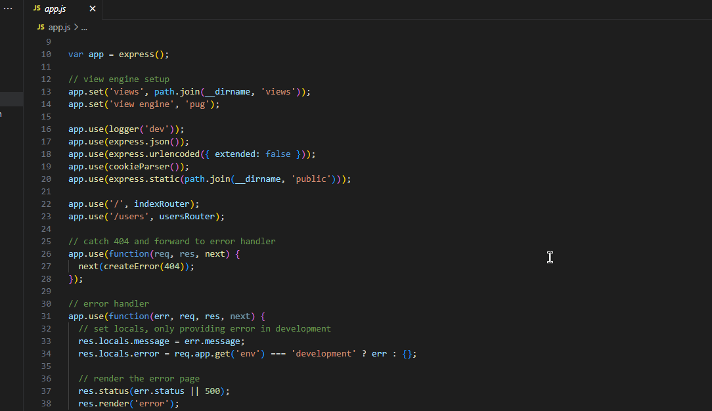
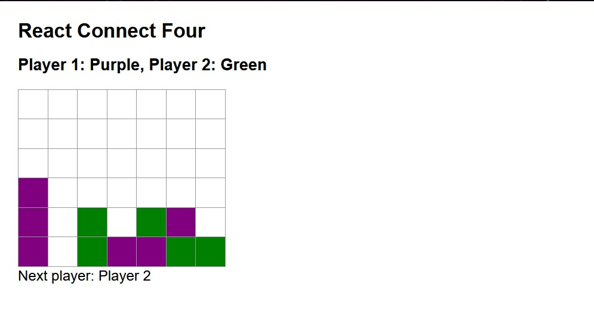

<h1 align="center">Hi I'm Adam Shigley 👋</h1>
 
<h3 align="center">I'm a computer science student at Weber State University! Please check out some of my projects below.</h3>

 
<h3 align="center">Check out the full repo: <a href="https://github.com/ashiggles/CS_Portfolio" target="_blank" rel="noreferrer">CS_Portfolio</a></h3>
 

<h4>🌎 1st Assignment: <a href="https://github.com/ashiggles/Portfolio_Project/tree/master/Projects/My_Express_App" target="_blank" rel="noreferrer">My Express App</a></h4>

 - The 1st assignment is the first initialization of an Express application. This project was just the beginning of the journey to learn the MERN stack. It involved going through the complete setup of Express in a development environment. This project wasn't too challenging.

<h4>📄 2nd Assignment: <a href="https://github.com/ashiggles/Portfolio_Project/tree/master/Projects/Node_Express_File_Storage" target="_blank" rel="noreferrer">Node And Express File Storage</a></h4>

 - The 2nd assignment included setting up Node with Express as well as demonstrating file storage. This project used a web form that allowed user input. I had to create a web form on one page, another page that displayed all text from the form submission, and another page that asks for a food item then matching results would display. The challenging part of this project was setting up and learning backend routing.

<h4>🌱 3rd Assignment: <a href="https://github.com/ashiggles/Portfolio_Project/tree/master/Projects/React_Connect_Four" target="_blank" rel="noreferrer">React Connect Four Game</a></h4>

 - The 3rd assignment was creating a Connect Four game with React. This project was fun and fun to play after it was created. The most challenging part of this project was figuring out a way to drop tiles to the bottom of the grid. This is also the first project we learned React.

<h4>📝 4th Assignment: <a href="https://github.com/ashiggles/Portfolio_Project/tree/master/Projects/RESTful_API_Bank_Account" target="_blank" rel="noreferrer">RESTful API Bank Account</a></h4>

 - The 4th assignment was an introduction to RESTful API and creates a backend for registering and accepting new bank account information. In this project we used Node, Express, and Mongo DB. The most interesting, but also the most challenging, part was learning RESTful API and getting experience using GET and POST. We had to create a full account registration, login, and user account list.

<h4>⚡ 5th Assignment: <a href="https://github.com/ashiggles/Portfolio_Project/tree/master/Projects/MERN_And_Sessions" target="_blank" rel="noreferrer">MERN And Session</a></h4>

 - The 5th assignment used the MERN stack and session data to create a functioning bank account application. This project was an extension to the previous project. In this project we added a React frontend for users.

<h4>🌱 6th Assignment: <a href="https://github.com/ashiggles/Portfolio_Project/tree/master/Projects/MERN_Hangman_Game" target="_blank" rel="noreferrer">MERN Hangman Game</a></h4>

 - The 6th assignment was a group assignment with <a href="https://github.com/KristaSmith1" target="_blank" rel="noreferrer">KristaSmith1</a>. We developed a functioning Hangman Game using the MERN stack. This was the first project where we utilized the full MERN stack. This project was also fun and fun to play after it was developed. The most challenging part was figuring out a way to add 1000+ words to our Mongo database. I found a way to generate randomly selected words and POST them to our database.

<h4>📝 7th Assignment: <a href="https://github.com/ashiggles/Portfolio_Project/tree/master/Projects/MERN_Banking_Website" target="_blank" rel="noreferrer">MERN Banking Website</a></h4>

 - The 7th assignment was a group assignment with <a href="https://github.com/KristaSmith1" target="_blank" rel="noreferrer">KristaSmith1</a> and <a href="https://github.com/Acroft96" target="_blank" rel="noreferrer">Acroft96</a>. We developed a functioning Banking website using the MERN stack. This project was a two part project where the first part was developing the frontend. We broke up the project in three ways and worked on our individual parts, this seemed to work the best. The second part was developing the backend and routing for all our banking data. We also broke this part up in three ways. The most challenging part was setting up the backend routing for all the user information we were displaying and editing. Overall I think this project went really well and turned out well.

 

<h3 align="left">Connect with me:</h3>
<h4>:octocat: <a href="https://github.com/ashiggles" target="_blank" rel="noreferrer">GitHub Profile</a></h4>
<h4>🔭 <a href="https://www.linkedin.com/in/adam-shigley-b84b9a94/" target="_blank" rel="noreferrer">LinkedIn Profile</a></h4>

 

<h3 align="left">Experience with Languages and Tools:</h3>

 
    
    
    
    
    
    
    
    
    
     
    
    
    
     

